# Tugas Pemrograman 2 - Pembuatan Aplikasi/Website

## MyBioskop

**Website MyBioskop** adalah sebuah platform simulasi pemesanan tiket bioskop secara online. Pengguna dapat memilih film, menentukan jumlah tiket yang diinginkan, serta melihat harga total yang harus dibayar. Antarmuka yang sederhana dan interaktif membuat pengguna dapat dengan mudah memahami proses pemesanan tiket.

Pembuatan website ini menggunakan **GitHub Pages** sebagai media hosting, serta **HTML**, **CSS**, dan **JavaScript** sebagai teknologi utama dalam pengembangannya.

---

## Alat dan Software yang Digunakan dalam pembuatannya 

- PC / Laptop
- HP (Handphone)
- Browser: Google Chrome
- Platform Version Control & Hosting: GitHub

---

## Cara Mengakses Website

Terdapat dua cara untuk mengakses atau menggunakan website ini:

1. **Download File**  
   Anda dapat mengunduh file website dalam bentuk .zip melalui repository GitHub ini dan menjalankannya secara lokal di browser.

2. **Akses Langsung**  
   Anda juga dapat mengakses versi online melalui tautan berikut:  
   [https://muhirabazram.github.io/MyBioskop/](https://muhirabazram.github.io/MyBioskop/)

---

## Tampilan Website

Berikut ini adalah beberapa tampilan halaman pada website **MyBioskop**, lengkap dengan fitur-fitur utama di dalamnya:

### 1. Halaman Beranda  
Tampilan awal website yang menyajikan pengenalan singkat dan visual menarik tentang layanan pemesanan tiket bioskop.  

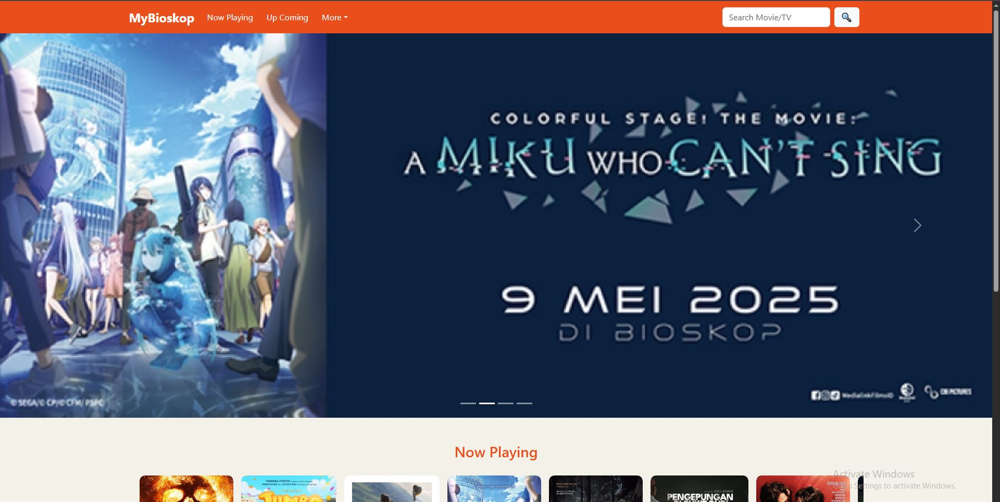
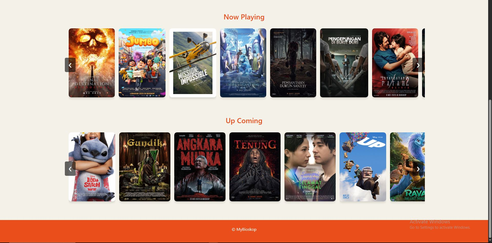

### 2. Halaman Now Playing & Upcoming Movies  
Menampilkan daftar film yang sedang tayang maupun yang akan datang, lengkap dengan poster film masing-masing.  

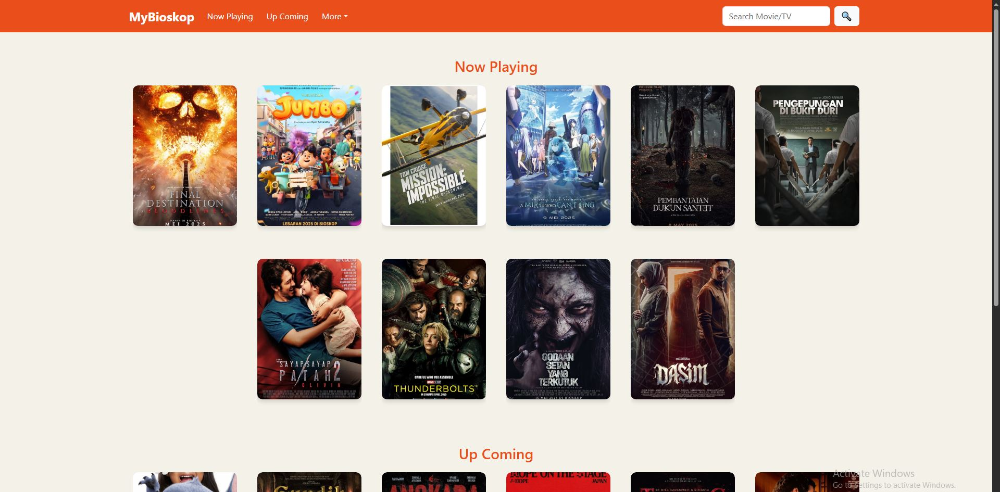
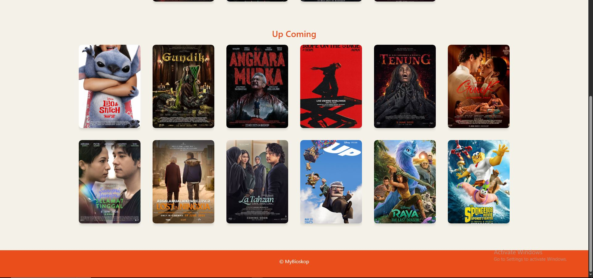

### 3. Efek Hover pada Poster Film  
Saat kursor diarahkan ke poster film, akan muncul dua tombol interaktif:  
- **Lihat Trailer** — Untuk menonton cuplikan film.  
- **Beli Tiket** — Untuk memulai proses pemesanan tiket.
- 

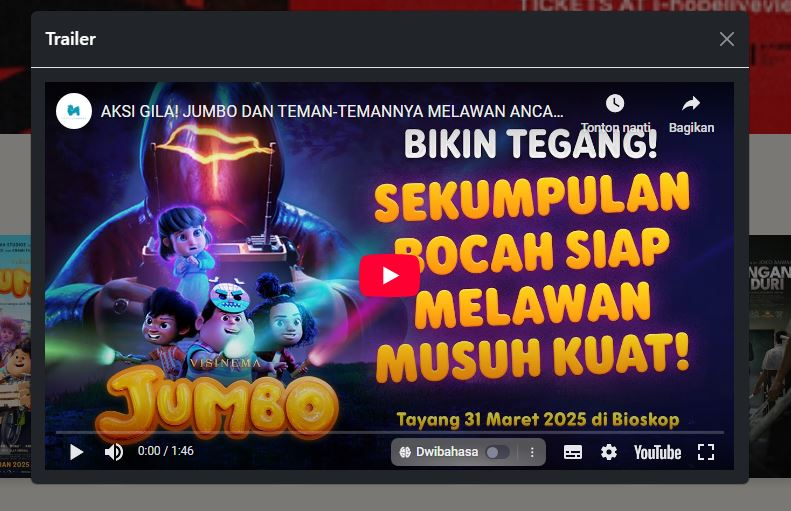

### 4. Halaman Detail Film  
Berisi informasi lengkap mengenai film yang dipilih, seperti sinopsis, director, genre, dan tombol untuk melanjutkan ke pemesanan tiket.  

### 5. Pemilihan Jadwal Tayang  
Pengguna dapat memilih tanggal dan jam penayangan sesuai preferensi.  

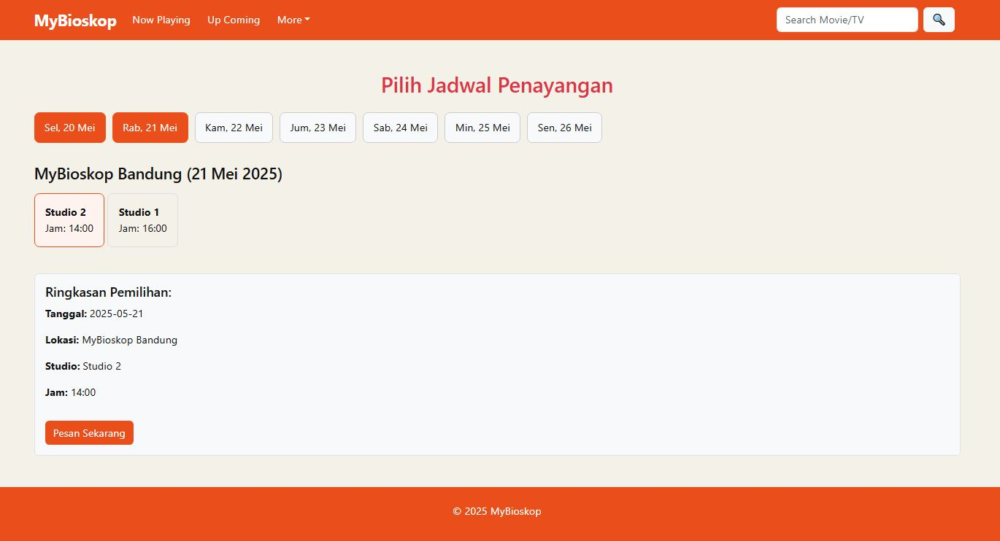

### 6. Formulir Pemesanan Tiket  
Menampilkan detail film yang akan ditonton, serta form input untuk mengisi **nama** dan **alamat email** pengguna.  

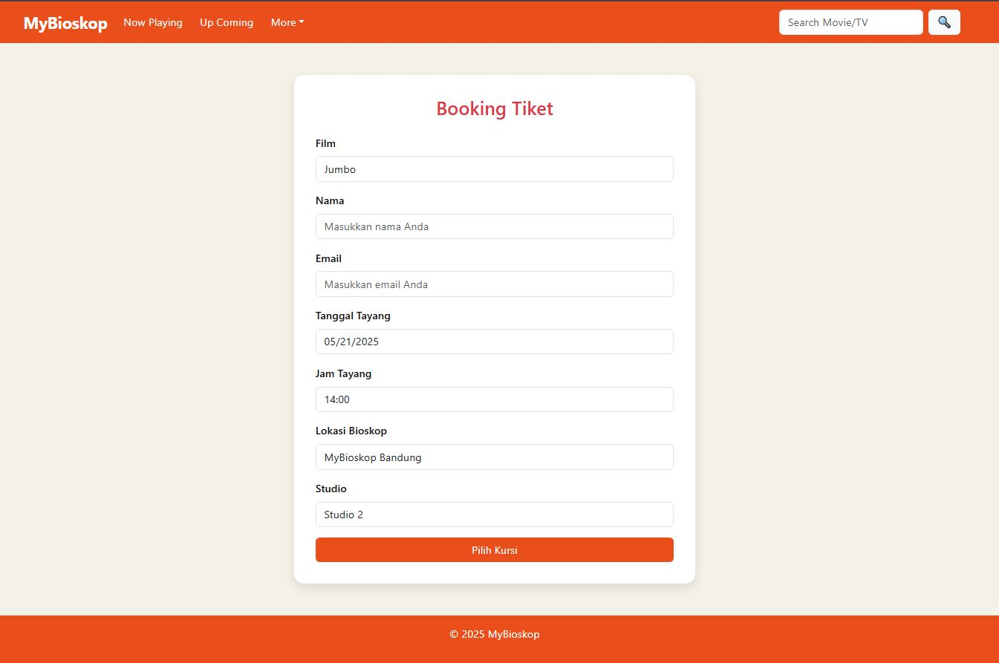
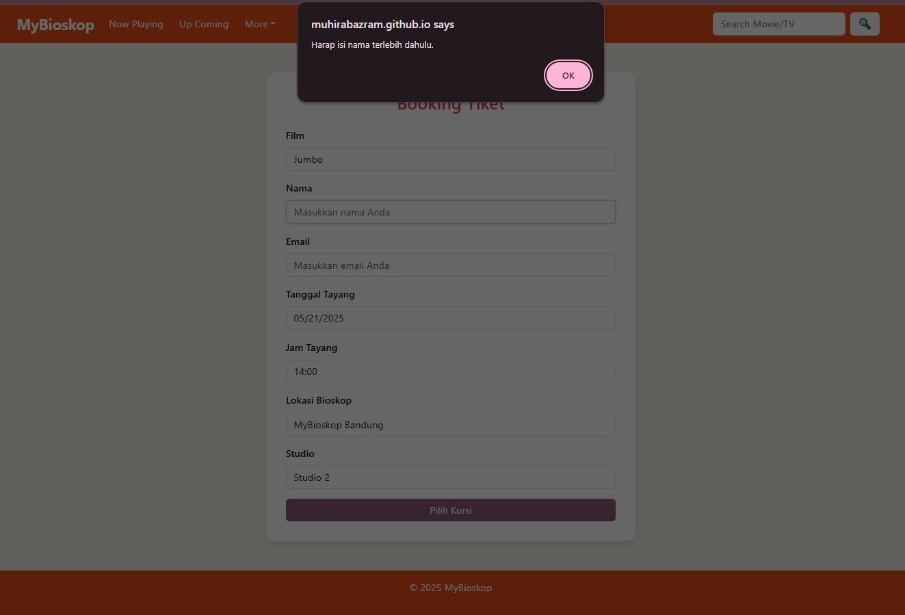
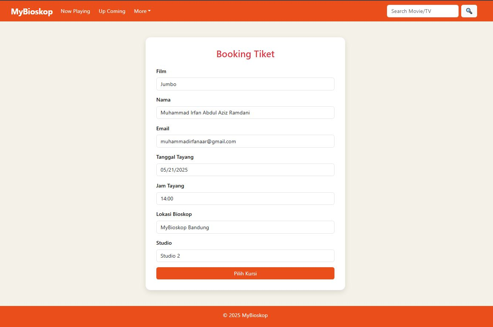

### 7. Pemilihan Kursi  
Pengguna dapat memilih kursi yang tersedia melalui layout interaktif tempat duduk di dalam studio bioskop.  

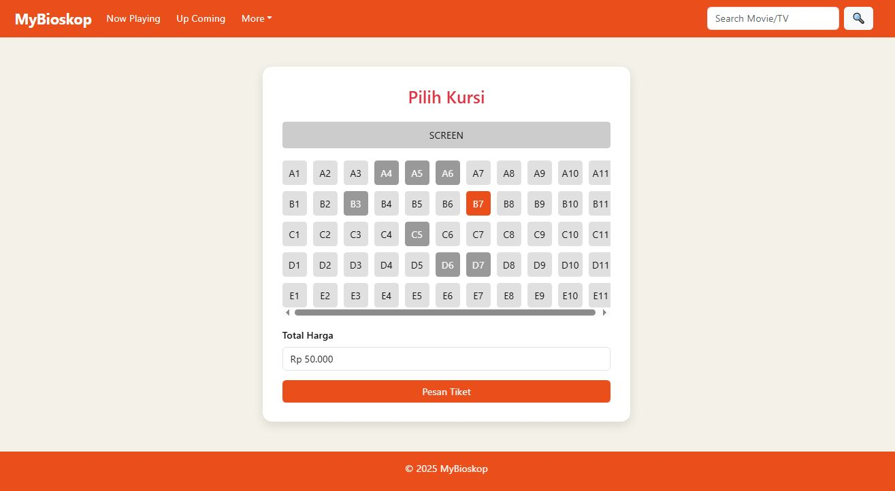

### 8. Halaman Konfirmasi Pesanan  
Menampilkan ringkasan lengkap pesanan sebelum melanjutkan ke proses pembayaran, termasuk data film, jadwal, kursi, dan identitas pengguna.  

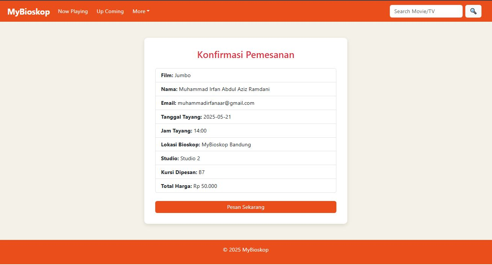

### 9. Metode Pembayaran  
Pengguna memilih metode pembayaran yang tersedia untuk menyelesaikan transaksi.  

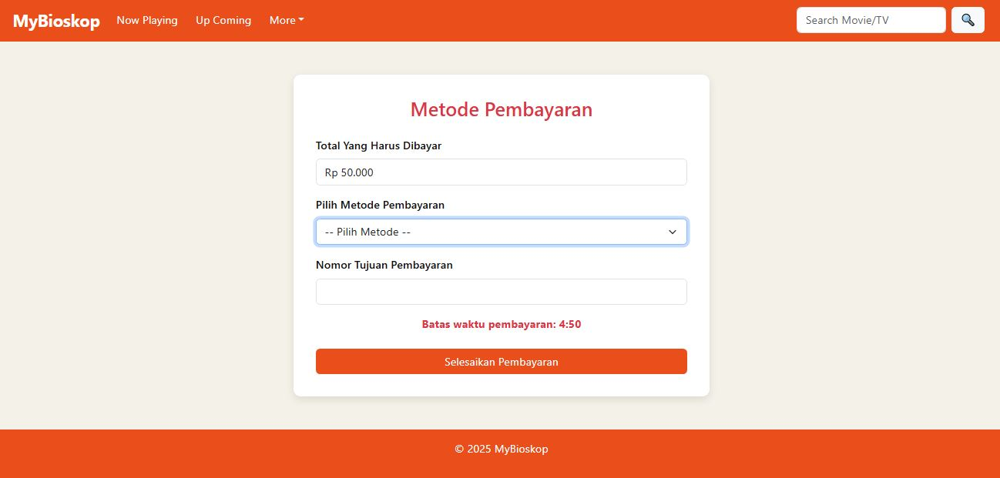
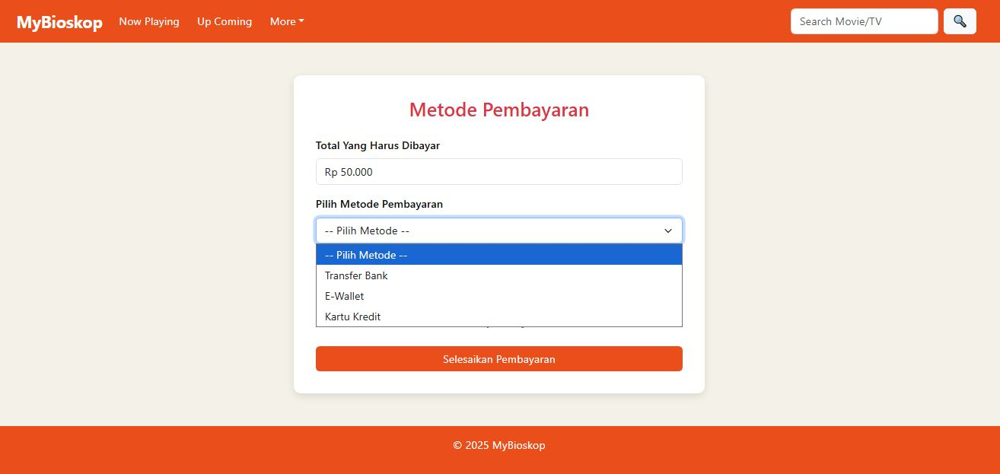
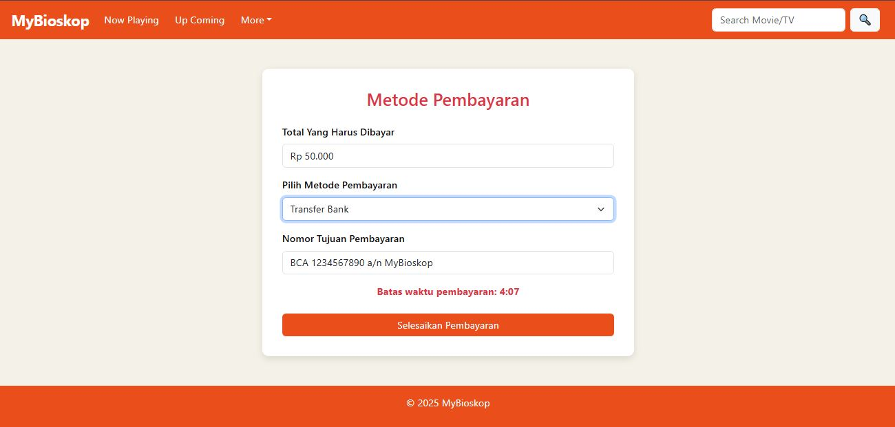
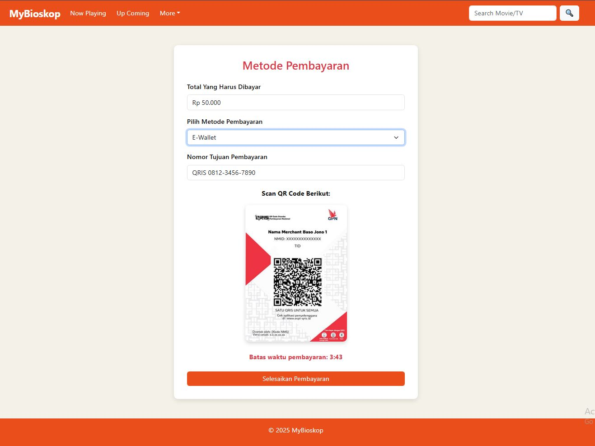
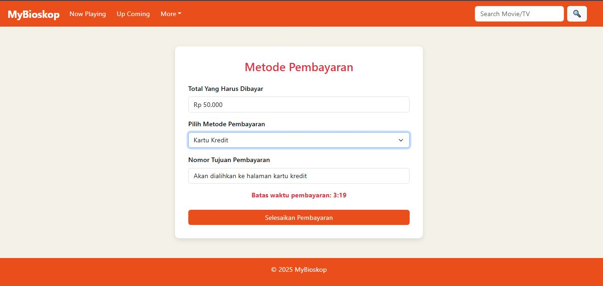
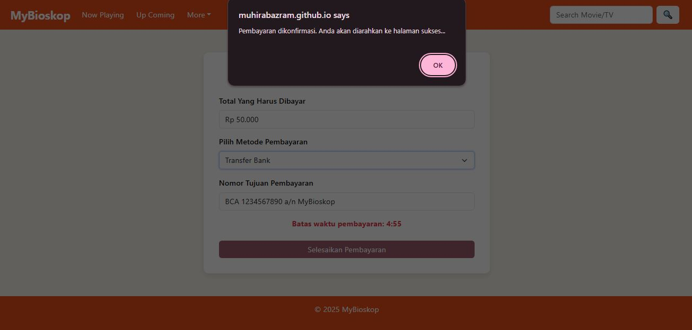

### 10. Halaman Sukses & Tiket  
Setelah pembayaran berhasil, pengguna diarahkan ke halaman sukses dan akan menerima tiket digital yang siap digunakan.  

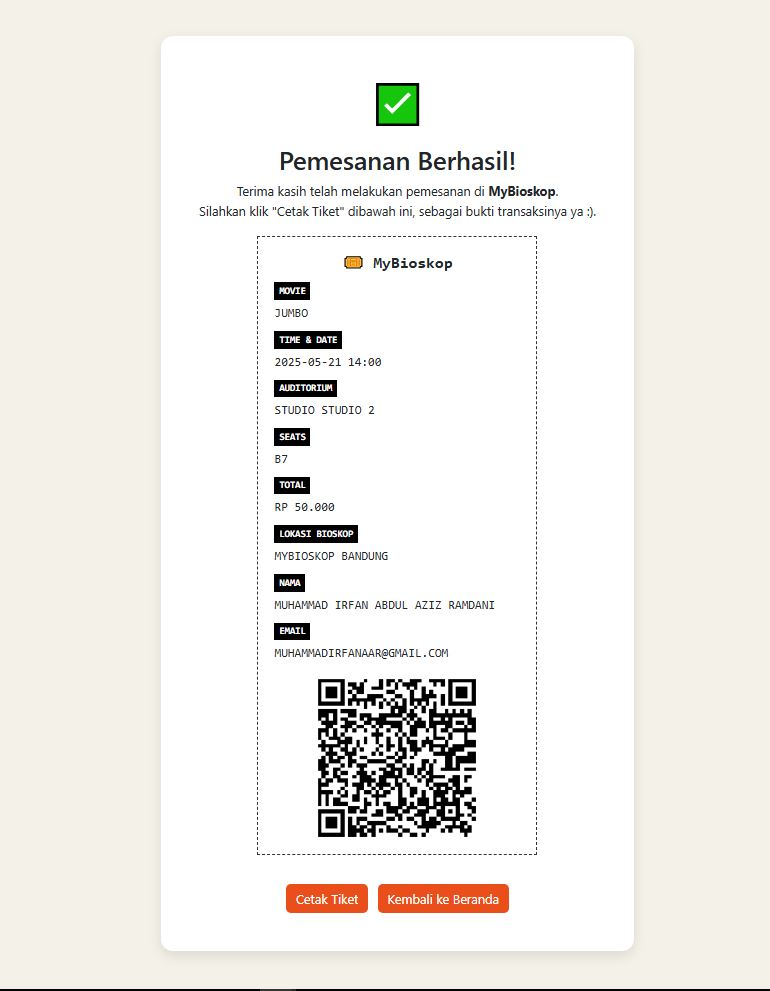

---

## Bahasa Pemrograman & Teknologi yang Digunakan

- **HTML** — Untuk struktur dasar halaman website
- **CSS** — Untuk tampilan dan desain antarmuka
- **JavaScript** — Untuk fitur interaktif seperti pemrosesan tiket
- **Bootstrap** — Framework CSS untuk mempercepat pengembangan UI

---

## About the Author

**Nama:** Muhammad Irfan Abdul Aziz Ramdani 

**NIM:** 1224014

**Program Studi:** Teknik Informatika  

**Universitas:** STMIK Bandung 

